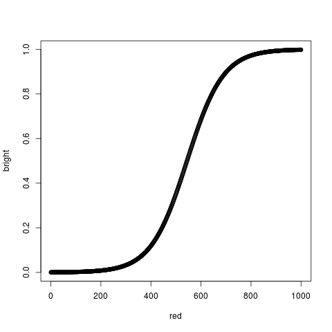
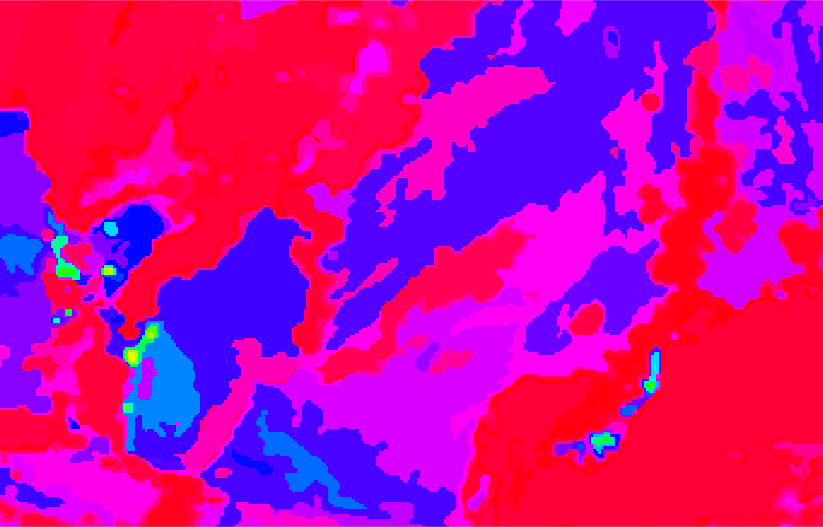

Finding greenhouses on Planet Labs images.
==========================================

This document describes current state of "Greenhouses project", classification results and methods used.

## Introduction

1. During the previous discussion we had the next conclusions:

 (a) Greenhouses are usually bright spots. There are also bright spots of other types (sandy soil for example), but the brightest spots are greenhouses and other buildings. The main difference between a greenhouse and a building is the size. (But there are big greenhouses and small buildings.)

 (b) Typical shapes of greenhouses are rectangular and the typical sizes of greenhouses are 4x10 -- 7x25 meters.

 (c) The Planet images are not well georeferenced: a greenhouse on one image can be shifted by upto 75 meters from another image.

 (d) A greenhouse may be clearly visible on one image and totally invisible on the other (taken in the same day).

2. Because of (1.c) and (1.d) we have two options:

 (a) create new (large and representative) training set;

 (b) use classification approaches that don't need training set.

3. We tried (2.b) approach, firstly we constructed some textural an spectral descriptors of greenhouses and background areas and used cluster analysis to find proper descriptions of greenhouses. Then we processed one of the scenes (scene_id = 20160711_174921_0c2b). The visual result is presented here: http://kolesov.nextgis.com/resource/100/display?base=osm-mapnik&lon=-123.8390&lat=40.1608&angle=0&zoom=12&styles=574,99,569,549 (ask us for the credentials).

The result contains a lot of false positive polygons, so we decided to try more complicated approach. This approach and the results are presented in the next sections.

## Main ideas

As we saw early, greenhouses are bright objects and we can describe them using few rules:

```
If we see
    BRIGHT SPOT
  and
    the SPOT is SMALL,
  and
    the SPOT has SIMPLE FORM
Then
  the SPOT is
    greenhouse or other building.
```

We can easy train a human to find greenhouses or other buildings using this rule. So we decided to create an expert system that simulates human approach. Because of uncertainties of such concepts like '`BRIGHT`', '`SPOT`' etc. we used fuzzy logic as underlaying engine of the system.

The result of first version of the system are presented below. Some technical details of the system are in Appendix.

### Pros and Cons

Advantages of the method:

 * the approach doesn't require a lot of training polygons;
 * the final results and intermediate data are simple to explain, analyze and debug by a human;
 * the system has relative simple architecture.

Disadvantages:

 * the approach can handle simple objects only (really it cloud handle complex objects also, but then the system isn't simple and the advantages disappear);
 * new types of data (new imagery set, new objects etc.) require new exploration and new reconstruction of the system.

## First results

We have created first version of the system. The system has several parameters that have to be adjusted. In the current version we set the parameters approximately without long explorations. We think that good-adjusted parameters improve the quality, but not dramatic, so we can use current parameters for proof of the concept.

We used two scenes (http://kolesov.nextgis.com/resource/100/display?base=osm-mapnik&lon=-123.8228&lat=40.1049&angle=0&zoom=11&styles=569,579,555,549) as testing area for setup the system parameters (see details in Appendix). 

Then we applied the system to other scenes taken in 11 jul 2016. The resulst are here http://kolesov.nextgis.com/resource/100/display?base=osm-mapnik&lon=-123.8385&lat=40.6925&angle=0&zoom=8&styles=595,551,555,527,549,529,545,553,563,521,535,559,523,561,539,543,547,531,537,533,541,557,525

The group 'NextGIS results' contains three layers producted by the expert system:

 * nextgis-answer:0.25,
 * nextgis-answer:0.50,
 * nextgis-answer:0.75.

The layers contains polygons that are classified as 'greenhouses or building' using the rule. The number in the layer name indicates 'certainty' in the answer. So layer 'nextgis-answer:0.75' contains few polygons, but the system is sure that the polygons are buildings/greenhouses. Layer
'nextgis-answer:0.25' contains a lot of polygons but the system doesn't 'certain' in the answer. (This 'certainties' isn't perfectly fitted, but they are good enough as proof of the concept).

## Appendix. Structure of the system.

### Architecture

The classification system was constructed as rule-based system (really we use only one rule now, but the system can handle multiple rules).

The current rule is:

```
If we see
    BRIGHT SPOT
  and
    the SPOT is SMALL,
  and
    the SPOT has SIMPLE FORM
Then
  the SPOT is
    greenhouse or other building.
```

The rule uses concepts '`BRIGHT`', '`SPOT`', '`SMALL`', '`SIMPLE FORM`'. So we have to give strong definitions for the concepts before using them in our system.

Below we describe the process.

*BRIGHT*

`BRIGHT` is the simplest concept because brightness is encoded in images: every pixel of PlanetLabs image has three components (RGB). Typical example of 'bright' pixel is something like (850-850-600). But of course if we take pixel (849-849-599), we can't say that this pixel is not bright. Obviously strict boundary between bright and dark pixels doesn't exist: there are a lot of values that are nether bright nether dark (or they are dark and bright in the same time). So we can use fuzzy logic approach to handle such uncertainties.

Therefore we need to construct membership function for fuzzy set "`BRIGHT PIXEL`". This function indicates deggre of brightness, for example it is equal to 1.0 for bright pixels and 0.0 for dark pixels.

To do this we took some training areas (bright and dark) and constructed auxiliary fuzzy sets "`BRIGHT RED COLOR`", "`BRIGHT GREEN COLOR`" and "`BRIGHT BLUE COLOR`". We decided use logistic function to fit the membership function. We found parameters of the logistic function that bright areas have values of the membership function near 1.0.

For example the membership function for fuzzy set  "`BRIGHT RED COLOR`" is presented below:



The X-axis is brightness of red component of a pixel, the Y-axis is the value of their membership function. So for example if the red component of a pixel is 900 then the value of membership function of "`BRIGHT RED COLOR`" is almost 1, if the red component of a pixel is 200, then the membership function is 0. But if the red component is for example 500, then the membership function is near 0.4 (degree of darkness is greater then degree of brightness).

Similar membership functions was created for other fuzzy sets.

Finally fuzzy set "`BRIGHT PIXEL`" was created using the next rule:

```
pixel is BRIGHT ==
   (pixel is BRIGHT RED)
 and
   (pixel is BRIGHT GREEN)
 and
   (pixel is BRIGHT BLUE)
```
(we use `min` function as logic `AND` in current implementation).

*SPOT*

Concept `SPOT` is more complex to define then concept `BRIGHT`. We can describe `SPOT` as "group of connected pixels of nearly same color/brightness". We decided to find such groups using Region Growing algorithm. This algorithm is a kind of clustering algorithm that uses spectral and spatial information during clusterization process. The algorithm isn't fuzzy, so the clusters have strict boundaries, but we can create fuzzy set "`BRIGHT SPOT`" that folds both concepts `BRIGHT` and `SPOT`.

So in result of this step scenes are divided on fuzzy sets "`BRIGHT SPOT`", they looks like continues areas with hard boundaries but every area contains a value in [0; 1]. This value is the degree of the spot's brightness (max value of membership function "`BRIGHT PIXEL`" in the area).

Example of result spots is presented below:


different colors encode different membership values: red colors are low degrees of brightness, green colors are high degrees.

*SMALL SPOT*

The next used concept is "`SMALL`" spot. This concept is simple: we can calculate areas of spots and compare them with usual areas of greenhouses. We used the next membership function for fuzzy set "`SMALL SPOT`":
```
value = 1 if spot area <250 sq.meters,
value = 0 if spot area > 2000 meters,
value = -spot_area/1750 + 8.0/7 otherwise
```


*SIMPLE FORM*

Concept "`SIMPLE FORM`" is connected to concept "`SPOT`". Buildings, greenhouses and other constructions have simple forms usually (compare to forms of spots on the previous picture). If a spot represent natural object (forest, river, etc.) then the spot looks like an amoeba with multiple pseudopodias. So we have to measure complexity of spot form. There are several approaches to do this, we used one of the simplest: we decided use compactness as measure of complexity.

```
compactness = perimeter / (2 * sqrt(PI * area))
```

If a polygon has long perimeter and low area, then the polygon has high compactness. For example compactness of circle equal to 1, compactness of square is 1.596, compactness of rectangular 1x5 is 2.14. Compactness of 'amoeba' is very hight.

We measured compactness of greenhouses in the training datasets and created the next membership function of fuzzy set "`SIMPLE FORM`"

```
value = 1 if spot_compactness < 1.4,
value = 0 if spot_compactness > 2.0,
value = -10*spot_compactness/6.0 + 20.0/6.0) otherwise
```

*Final step*

We have difined all concepts used in the rule. As result we can concatenate all parts of the rule using functions of fuzzy logic. In out case we have only one logic finction (`AND`). We used `min` function as logic `AND`.


### Ways to improvements

There are some steps that can be done to improve the quality of classification:

 * We didn't fit very well the membership functions. Good fitting on large training sets could impove the result.
 * We didn't studied different clusterization methods for create '`SPOTS`'. Probably different algorithms or their parameters can produce more adequate '`SPOTS`'.
 * We didn't studied different realisations of `AND` function. 

We think that the studies have to be done and that the result could be better. But the final result hardly depends on the used data (PlanetLabs imagery), therefore the main improvement can be achieved by more adequate images.
